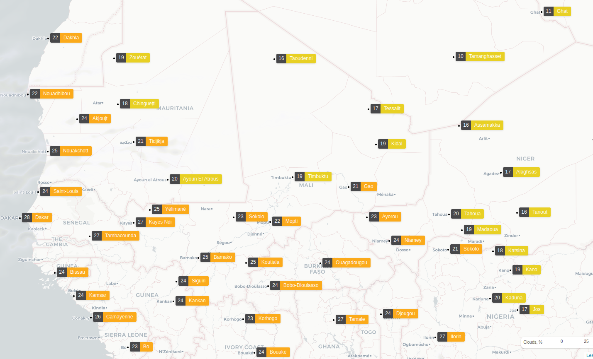

 
  # Did you know that... 
  ## Today the weather in Timbuktu is:

   

    

      <table style="margin:5%;margin-top:0px">
        <tr>
          <th>key</th>
          <th>value</th>
        </tr>
        <tr>
          <td>Weather</td>
          <td>clear sky</td>
        </tr>
        <tr>
          <td>Temp feels like</td>
          <td>17.09 °C</td>
        </tr>
         <tr>
          <td>Pressure </td>
          <td>1014 hPa</td>
        </tr>
         <tr>
          <td>Longitude</td>
          <td>-3.0074</td>
        </tr>
         <tr>
          <td>Latitude</td>
          <td>16.7735</td>
        </tr>
        <tr>
          <td>date time</td>
          <td>2022-02-10 22:29:44.242046</td>
        </tr>
      </table> 
    

    

      
    

  
 

  ### for more info about this project check [`info.md`](/info.md)
  